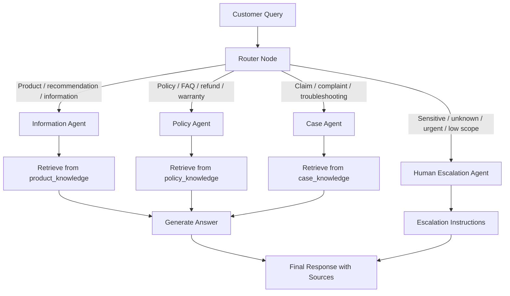

# NTU SCTP Advanced Professional Certificate in Data Science & AI  
## Capstone Project: Online Support Agent

## Author Information

- **Learner Name:** Ed Heng
- **Institution:** National Technological University (NTU)
- **Course:** SCTP Advanced Professional Certificate in Data Science and AI
- **Project Title:** Online Support Agent Capstone Project

---

## 1. Project Overview

This project implements a **multi-agent online support system** using **LangGraph** and **Retrieval-Augmented Generation (RAG)**. The system intelligently routes customer inquiries to specialised agents and retrieves relevant knowledge from domain-specific knowledge bases.

The provided architecture is domain-agnostic. It can support e-commerce, financial services, insurance, telecommunications, career advisory, or other online support use cases by replacing the files inside the `/data/` folders.

The current starter package includes the uploaded `job_dataset.csv` under `data/product/`, allowing the Information Agent to answer questions related to skills, job categories, and course types after ingestion.

---

## 2. Project Deliverables

This repository contains:

| File | Purpose |
|---|---|
| `ingestion.py` | Processes files, chunks text, creates embeddings, and persists Chroma vector database collections. |
| `app.py` | Main Streamlit application implementing the LangGraph multi-agent workflow. |
| `README.md` | Setup guide, architecture explanation, and design rationale. |
| `requirements.txt` | Python dependencies. |
| `.env.example` | Example environment variables. |
| `data/product/job_dataset.csv` | Uploaded source dataset used as the sample product/information knowledge base. |

---

## 3. Folder Structure

```text
ntu_online_support_agent/
├── app.py
├── ingestion.py
├── requirements.txt
├── README.md
├── .env.example
├── .gitignore
├── data/
│   ├── product/
│   │   └── job_dataset.csv
│   ├── policy/
│   └── case/
└── vectorstore/
    └── chroma_db/        # Created after running ingestion.py
```

---

## 4. Setup and Execution

### Step 1: Create a Python Environment

```bash
python -m venv .venv
```

Activate it:

**Windows**

```bash
.venv\Scripts\activate
```

**macOS / Linux**

```bash
source .venv/bin/activate
```

### Step 2: Install Dependencies

```bash
pip install -r requirements.txt
```

### Step 3: Configure Environment Variables

Copy the example environment file:

```bash
cp .env.example .env
```

Optional: add a Groq API key to use an LLM response generator.

```text
GROQ_API_KEY=your_groq_api_key_here
GROQ_MODEL=llama-3.1-8b-instant
```

If no Groq API key is provided, the app still runs in a safe extractive fallback mode.

### Step 4: Add Knowledge Base Files

Place domain documents into the relevant folders:

```text
data/product/   # Product details, catalogues, course/job datasets, service descriptions
data/policy/    # FAQs, refund policies, privacy policy, shipping policy, company rules
data/case/      # Troubleshooting guides, claims process, return workflow, complaints process
```

Supported formats:

```text
.txt, .md, .csv, .xlsx, .pdf
```

### Step 5: Build the Vector Database

```bash
python ingestion.py --data-dir data --persist-dir vectorstore/chroma_db
```

This creates three persisted Chroma collections:

| Folder | Collection |
|---|---|
| `data/product/` | `product_knowledge` |
| `data/policy/` | `policy_knowledge` |
| `data/case/` | `case_knowledge` |

### Step 6: Run the Application

```bash
streamlit run app.py
```

Open the local Streamlit URL shown in the terminal.

---

## 5. System Architecture

### High-Level Architecture



---

## 6. LangGraph Workflow

The application uses `StateGraph` from LangGraph.

### Graph State

The graph state is defined as:

```python
class AgentState(TypedDict):
    query: str
    route: Literal["information", "policy", "case", "human"]
    context: str
    answer: str
    citations: List[str]
    confidence: float
```

### Nodes

| Node | Purpose |
|---|---|
| `router` | Determines which specialised agent should handle the query. |
| `information` | Answers questions using the product/information knowledge base. |
| `policy` | Answers policy, FAQ, refund, warranty, privacy, and compliance-related questions. |
| `case` | Guides users through multi-step support workflows such as claims, returns, complaints, or troubleshooting. |
| `human` | Fallback route for sensitive, urgent, ambiguous, or unsupported queries. |

### Conditional Edges

The router uses keyword-based logic to send the query to one of four routes:

```text
router → information
router → policy
router → case
router → human
```

The routing strategy is intentionally transparent for academic assessment. It can be extended later with LLM-based classification or confidence scoring.

---

## 7. Agent Design

### 7.1 Information Agent

The Information Agent retrieves from `product_knowledge`. It is suitable for:

- Product or service details
- Course or job recommendations
- Skills matching
- General information requests
- Comparison or recommendation questions

Example query:

```text
What course type would you recommend for someone strong in ML, cloud, and programming?
```

### 7.2 Policy Agent

The Policy Agent retrieves from `policy_knowledge`. It is suitable for:

- Refund policy
- Return policy
- Warranty policy
- Privacy and data policy
- FAQs
- Company terms and conditions

Example query:

```text
What is the refund policy if I cancel my order?
```

### 7.3 Case Agent

The Case Agent retrieves from `case_knowledge`. It is designed as a multi-step workflow agent.

It handles:

- Claims
- Returns
- Complaints
- Troubleshooting
- Technical issues
- Service recovery workflows

Example query:

```text
My product is not working. How do I file a support case?
```

### 7.4 Human Escalation Agent

The Human Escalation Agent is triggered when:

- The query is outside the supported domain
- The issue is urgent or sensitive
- The customer requests a human
- The system has insufficient retrieved evidence
- The query may involve legal, safety, or personal data concerns

Example query:

```text
I want to speak to a manager immediately about a legal complaint.
```

---

## 8. Retrieval-Augmented Generation Design

### Ingestion Pipeline

`ingestion.py` performs the following steps:

1. Reads files from `/data/product`, `/data/policy`, and `/data/case`.
2. Converts each supported file into LangChain `Document` objects.
3. Splits long documents into overlapping chunks.
4. Generates embeddings using a Hugging Face sentence-transformer model.
5. Persists the vector database using Chroma.

### Chunking Strategy

The default chunking configuration is:

```python
chunk_size = 900
chunk_overlap = 150
```

This balances context preservation and retrieval precision.

### Vector Store

The project uses **Chroma** because it is:

- Easy to run locally
- Persistent
- Suitable for small to medium capstone projects
- Compatible with LangChain retrievers
- Simple to deploy for demonstration purposes

---

## 9. Design Rationale

### Embedding Model

Default embedding model:

```text
sentence-transformers/all-MiniLM-L6-v2
```

Rationale:

- Lightweight and fast
- Works locally
- No paid API required
- Good baseline semantic retrieval performance
- Suitable for Streamlit and classroom demonstration

### LLM Choice

The app supports Groq via:

```text
llama-3.1-8b-instant
```

Rationale:

- Fast inference
- Simple API integration
- Suitable for real-time support chat
- Can be replaced with OpenAI, Anthropic, Azure OpenAI, Ollama, or Hugging Face endpoints

If `GROQ_API_KEY` is not configured, the app falls back to an extractive answer mode using retrieved context.

### Routing Strategy

The initial router uses transparent keyword matching. This was selected because:

- It is easy to explain in a capstone assessment
- It is deterministic
- It avoids unnecessary LLM calls
- It can be audited and improved

Future enhancement:

- Replace keyword routing with an LLM classifier
- Add route confidence thresholding
- Add query rewriting before retrieval
- Add user intent classification

---

## 10. Robust Error Handling and Guardrails

The system includes the following guardrails:

- Unsupported queries are routed to the Human Escalation Agent.
- If no vector database is found, the app provides a clear instruction to run ingestion.
- If the LLM API key is missing, the app runs in fallback mode instead of crashing.
- The agent response includes citations from retrieved sources.
- The Case Agent recommends escalation when retrieval confidence is low.

---

## 11. Optional Enhancements for Higher Marks

Recommended extensions:

1. **LLM-based Router**  
   Replace keyword routing with a structured LLM classifier.

2. **Conversation Memory**  
   Store previous customer turns in the graph state.

3. **Feedback Capture**  
   Add thumbs-up/thumbs-down feedback to evaluate agent quality.

4. **Admin Upload Page**  
   Allow users to upload new policy/product/case files from the Streamlit interface.

5. **Human Ticket Creation**  
   Save escalated cases into a CSV, SQLite database, or CRM API.

6. **Domain Adaptation**  
   Replace the provided sample data with financial services, insurance, telco, healthcare, or education domain documents.

7. **Evaluation Notebook**  
   Create a set of test queries and measure routing accuracy, retrieval precision, and answer quality.

---

## 12. Example Test Queries

### Information Agent

```text
Recommend suitable options for a user with strong AI programming and cloud skills.
```

```text
What information is available about job categories and course types?
```

### Policy Agent

```text
What is the refund policy?
```

```text
How does the company handle customer privacy?
```

### Case Agent

```text
My order arrived damaged. How do I raise a case?
```

```text
I need help troubleshooting a failed service request.
```

### Human Escalation Agent

```text
I want to speak to a human manager about a legal complaint.
```

---

## 13. Deployment Notes

### Local Deployment

Use:

```bash
streamlit run app.py
```

### Hugging Face Spaces Deployment

1. Create a new Hugging Face Space.
2. Select **Streamlit** as the SDK.
3. Upload these files:

```text
app.py
ingestion.py
requirements.txt
README.md
data/
```

4. Add secrets if using Groq:

```text
GROQ_API_KEY=your_key_here
GROQ_MODEL=llama-3.1-8b-instant
```

5. Run ingestion locally first and upload `vectorstore/chroma_db`, or add a startup step to build it.

For a production app, pre-building and uploading the vector database is recommended.

---

## 14. Submission Checklist

- [x] `ingestion.py` included
- [x] `app.py` included
- [x] `README.md` included
- [x] Modular folder structure included
- [x] RAG vector database design included
- [x] LangGraph state, nodes, and conditional edges included
- [x] Information Agent included
- [x] Policy Agent included
- [x] Case Agent included
- [x] Human Escalation Agent included
- [x] Setup and execution instructions included
- [x] Design rationale included
- [x] Optional enhancements documented

---

## 15. Academic Integrity Note

This project is designed as a capstone starter implementation. Learners should review, customise, test, and extend the code using their own domain-specific data and explanations before final submission.
